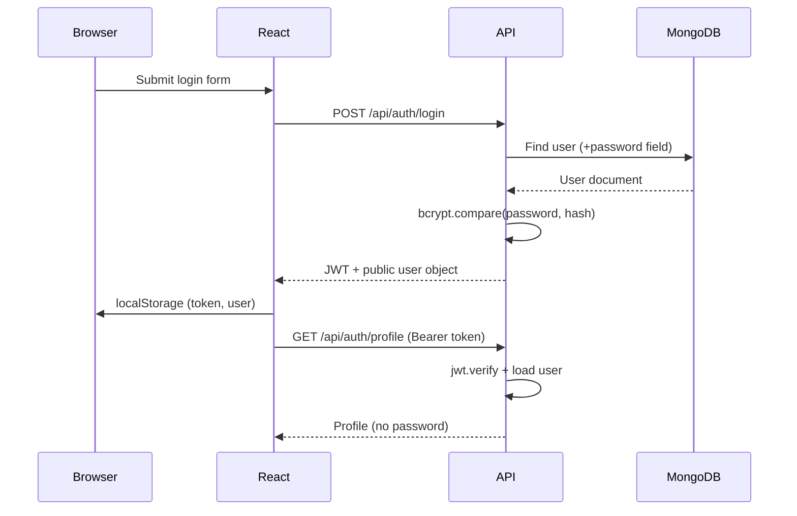

# Authentication Architecture

## Flow overview

## Backend

| Component | Responsibility |
|-----------|----------------|
| `models/User.js` | Schema; `pre('save')` hashes password with bcrypt |
| `controllers/authController.js` | Register, login, profile |
| `middleware/authMiddleware.js` | Validates JWT; attaches `req.user` |
| `utils/authHelpers.js` | Token signing; public user shape |

## Frontend

| Component | Responsibility |
|-----------|----------------|
| `services/authService.js` | Axios calls + localStorage session |
| `context/AuthContext.jsx` | Global auth state; bootstrap profile on load |
| `routes/ProtectedRoute.jsx` | Blocks dashboard routes |
| `routes/PublicRoute.jsx` | Redirects logged-in users from login |

## JWT

- Signed with `JWT_SECRET` from `.env`
- Payload: `{ id, email, role }`
- Expiry: 8 hours
- Sent as: `Authorization: Bearer <token>`

## Security practices

- Passwords hashed with bcrypt (12 rounds) before MongoDB save
- `password` field has `select: false` — excluded from queries by default
- Login uses generic error: "Invalid email or password"
- API never returns password or hash in JSON
- Change `JWT_SECRET` and demo credentials in production
