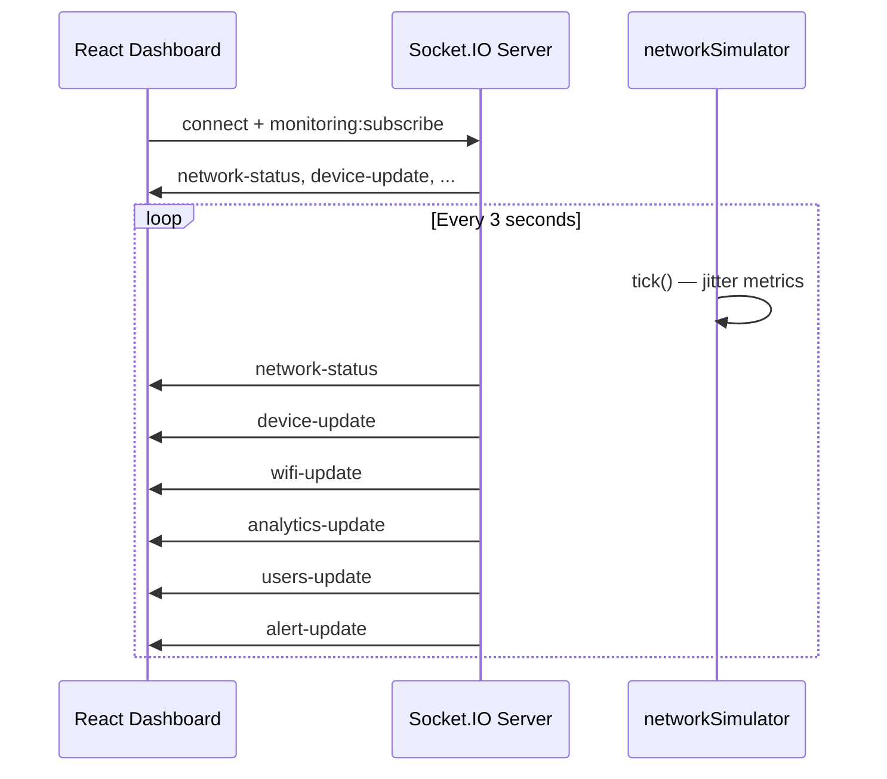

# Real-Time Monitoring Architecture

## Socket.IO flow



## Server modules

| File | Role |
|------|------|
| `sockets/index.js` | Connection logs, room `monitoring`, 3s broadcast |
| `services/networkSimulator.js` | Dummy devices, WiFi, users, alerts, charts |
| `controllers/networkController.js` | REST snapshots for initial load |

## Socket events

| Event | Payload |
|-------|---------|
| `network-status` | WAN speed, latency, overall health |
| `device-update` | Router, switch, AP, firewall list |
| `wifi-update` | SSIDs (password always `********`) |
| `analytics-update` | Chart series + summary cards |
| `users-update` | Connected clients table |
| `alert-update` | `{ type: 'new' \| 'sync', alerts, alert? }` |

## Frontend

| File | Role |
|------|------|
| `services/socketService.js` | Connect, reconnect, error handling |
| `hooks/useRealtimeMonitoring.js` | Subscribes to all events |
| `context/RealtimeContext.jsx` | Shared state + alert toasts |
| `components/monitoring/*` | StatCard, charts, tables |

## How dashboard updates work

1. User logs in → `connectSocket()` runs.
2. `RealtimeProvider` (inside dashboard layout) mounts `useRealtimeMonitoring`.
3. Server sends full snapshot on connect, then every **3 seconds**.
4. React state updates → stat cards and Recharts re-render.
5. New critical/warning alerts trigger bottom-right toasts.

## Adding real scanners later (legitimate ops only)

Replace `networkSimulator.tick()` with adapters that ingest **authorized** data:

1. **SNMP** — read-only community strings from env; poll devices in `BASE_DEVICES`.
2. **Syslog / SIEM** — push alerts into `state.alerts` instead of random templates.
3. **Controller APIs** — Cisco/Meraki/UniFi official APIs for WiFi clients.
4. **ICMP ping** — simple reachability for `status` (no port scanning).

Keep the same Socket.IO event names so the React UI stays unchanged:

```javascript
// services/networkPoller.js (future)
const snapshot = await pollAuthorizedDevices();
io.to('monitoring').emit('device-update', snapshot.devices);
```

Never embed real WiFi passwords in API responses — continue masking as `********`.
